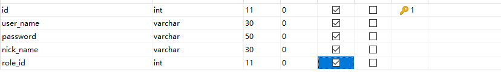
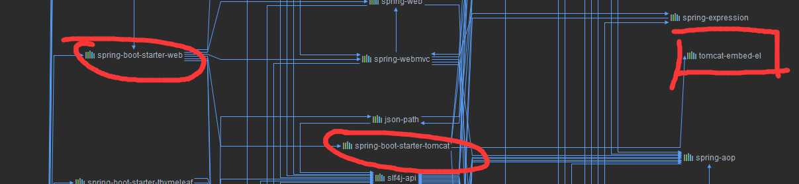
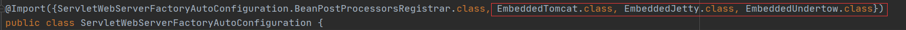

# 2.13 Spring boot

### 从mvc模型到Restful风格

#### 	MVC与RESTful的区别

1. MVC是一种经典的设计模式，全名为Model-View-Controller，即模型-视图-控制器。其中，模型是用于封装数据的载体，例如，在Java中一般通过一个简单的POJO（Plain Ordinary Java Object）来表示，其本质是一个普通的java Bean，包含一系列的成员变量及其getter/setter方法。对于视图而言，它更加偏重于展现，也就是说，视图决定了界面到底长什么样子，在Java中可通过JSP来充当视图，或者通过纯HTML的方式进行展现，而后者才是目前的主流。模型和视图需要通过控制器来进行粘合，例如，用户发送一个HTTP请求，此时该请求首先会进入控制器，然后控制器去获取数据并将其封装为模型，最后将模型传递到视图中进行展现。

2. REST本质上是使用URL来访问资源的一种方式。众所周知，URL(Uniform Resoure Locator:统一资源定位器)就是我们平常使用的请求地址了，其中包括两部分：请求方式与请求路径。

3. 两者具体肉眼可见（真）的不同就在于访问的连接，Restful风格的uri仅仅代表了资源的定位信息，而具体操作则通过请求方式来确定，而mvc模式下的uri则会表明了具体的操作方式，换而言之，Restful风格的uri只能看见资源的名称而没有动词描述动作。举个例子：

   | 动作     | MVC模型              | Restful风格         |
   | -------- | -------------------- | ------------------- |
   | Create   | /saveUser?name=xxx   | POST:    /user      |
   | Retrieve | /getUser?name=xxx    | GET:      /user     |
   | Update   | /updateUser?name=xxx | PUT:      /user/xxx |
   | Delete   | /deleteUser?name=xxx | DELETE:/user/xxx    |

#### Restful风格的原理

在访问一个网络地址时，比较常见的请求方式是GET与POST，但在REST中又提出了几种其它类型的请求方式，汇总起来有六种：GET、POST、PUT、DELETE、HEAD、OPTIONS。尤其是前四种，正好与CRUD（Create-Retrieve-Update-Delete，增删改查）四种操作相对应，例如，GET（查）、POST（增）、PUT（改）、DELETE（删），这正是REST与CRUD的异曲同工之妙！需要强调的是，REST是面向资源(ROA)的，这里提到的资源，实际上就是我们常说的领域对象，在系统设计过程中，我们经常通过领域对象来进行数据建模。REST是一个无状态的架构模式，因为在任何时候都可以由客户端发出请求到服务端，最终返回自己想要的数据，当前请求不会受到上次请求的影响。也就是说，服务端将内部资源发布REST服务，客户端通过URL来定位这些资源并通过HTTP协议来访问它们。

### 使用Restful风格开发用户管理

目标：使用restful风格实现用户的增删查改功能。根据登录用户的权限等级决定显示的是所有的用户还是该用户自己；每一个用户仅可以对自己的资料进行更改，不能更改权限和用户名；管理员才有删除用户的权限，同时不能删除自己。

用户表设计如下。

| 动作             | restful风格uri            | http请求方式 |
| ---------------- | ------------------------- | ------------ |
| 查询用户         | /users                    | GET          |
| 查询用户个人资料 | /users/profile/{username} | GET          |
| 删除用户         | /users/{username}         | DELETE       |
| 修改用户         | /users/profile/{username} | PUT          |

# 2.14 Spring boot

spring boot程序内有对tomcat的依赖，也就是说在不配置外部servlet服务器的情况下spring boot的web程序会在内部嵌入的tomcat服务器中运行。

除了tomcat之外，还有jetty和undertow可以被spring boot作为嵌入式服务器进行应用。

