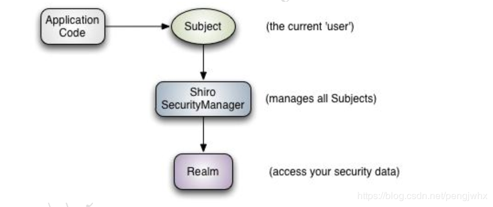

# 2.27 spring boot

### 整合`shiro`

#### 			目前的登录功能

目前的登录功能如下：用户输入用户名和密码，访问数据库查找该用户，通过调用一些加密的方法对表单提供的密码进行加密，然后对比数据库中的数据是否一致，一致则将登录用户存放在session中。

虽然说可以自己进行加密保证密码的安全，但是如果整个项目变大变复杂之后，一个网站会出现多个不同的网页，可能会存在不同的服务器中，总不能说每一次跳转就需要用户再登录一遍，这时候就需要单点登录的功能，而我目前的demo则没有完成这一个功能。

目前在网上搜索比较多的是`shiro`+`sso`系统来完成单点登录的功能。

但是我这个demo中还没有这个需要，于是就只将`shiro`整合进来进行登录认证和授权管理。

#### 			配置`shiro`

```xml
<dependency>
    <groupId>org.apache.shiro</groupId>
    <artifactId>shiro-spring</artifactId>
    <version>1.4.2</version>
</dependency>
```

首先引入`shiro`跟spring整合的依赖，里面包含了`shiro` web和`shiro` core。

Shiro框架中有三个核心概念：[Subject ，SecurityManager和Realms](https://blog.csdn.net/peterwanghao/article/details/8015571)。subject是指当前与系统交互的东西；`SecurityManager`则是管理所有操作的一个管理者，需要在程序中需要创建相关的bean；而Realm则是提供给`shiro`进行授权和认证操作的。



这时候就需要在`ioc`容器中注册`shiro`，`shiro`需要`SecurityManager`，而`SecurityManager`则需要realm；所以说这里一共3个bean，第一个`ShiroFilterFactoryBean`，在`ioc`容器中注册`shiro`；第二个`DefaultWebSecurityManager`，指定`shiro`使用这个`WebSecurityManager`；第三个则是一个`Realm`（可以自己写也可以用各种`shiro`内置的realm如`JDBCRealm`等）给`WebSecurityManager`使用。

```java
@Configuration
public class ShiroConfig {
    @Bean
    public ShiroFilterFactoryBean shiroFilterFactoryBean(DefaultWebSecurityManager defaultWebSecurityManager){
        ShiroFilterFactoryBean shiroFilterFactoryBean = new ShiroFilterFactoryBean();
        shiroFilterFactoryBean.setSecurityManager(defaultWebSecurityManager);
		Map<String,String> filterMap = new LinkedHashMap<>();
        //业务逻辑代码省略，一些拦截规则
        shiroFilterFactoryBean.setFilterChainDefinitionMap(filterMap);
        shiroFilterFactoryBean.setLoginUrl("/login");
        //设置登录页面，没有登陆而访问一些页面的时候则会重定向到登陆页面
        shiroFilterFactoryBean.setUnauthorizedUrl("/unauth");
        //设置权限不足的页面，当然也可以通过设置错误页面来做处理，访问某些页面而权限不足时会报4xx错误
        return shiroFilterFactoryBean;
    }

    @Bean
    public DefaultWebSecurityManager defaultWebSecurityManager(UserLoginRealm userLoginRealm){
        DefaultWebSecurityManager defaultWebSecurityManager = new DefaultWebSecurityManager();
        defaultWebSecurityManager.setRealm(userLoginRealm);
        return defaultWebSecurityManager;
    }

    @Bean
    public UserLoginRealm userRealm(){
        return new UserLoginRealm();
    }
}
```

#### 自定义Realm

```java
public class UserLoginRealm extends AuthorizingRealm {
    private final String HASH_ALGORITHM_NAME = "MD5";
    private final int HASH_ITERATION_TIMES = 6;

    @Autowired
    private UserLoginServiceImpl loginService;

    public UserLoginRealm() {
        HashedCredentialsMatcher matcher = new HashedCredentialsMatcher();
        matcher.setHashIterations(HASH_ITERATION_TIMES);
        matcher.setHashAlgorithmName(HASH_ALGORITHM_NAME);
        this.setCredentialsMatcher(matcher);
   		//设置这个realm使用什么credentialMathcer，用作验证证明也就是我们常说的密码
    }

    @Override
    protected AuthorizationInfo doGetAuthorizationInfo(PrincipalCollection principalCollection) {
        //这个方法是用作授权，完成一些授权的逻辑
        SimpleAuthorizationInfo info = new SimpleAuthorizationInfo();
       	//业务代码省略
        return info;
    }

    @Override
    protected AuthenticationInfo doGetAuthenticationInfo(AuthenticationToken authenticationToken) throws AuthenticationException {
        //这个方法是用作认证，即登录验证的功能
        UsernamePasswordToken token = (UsernamePasswordToken) authenticationToken;
        User user = loginService.getUserByUsername(token.getUsername());
        if (user==null) {
            throw new UnknownAccountException("用户不存在");
        }else {
            ByteSource salt = ByteSource.Util.bytes(user.getSalt());
            return new SimpleAuthenticationInfo(user,user.getPassword(),salt,getName());
        }
    }
}
```

#### 使用`shiro`：认证

配置完了该怎么使用呢？


这幅图表述的很清楚了，首先一个`Subject`调用`login`方法并且传入一个token，然后交给我们的`Security Manager`并且使用一些验证的策略来进行验证，比如说对token传过来的密码进行加密然后跟数据库进行校验等；而realm则是提供安全实体（个人理解就是在数据库中的用户，也就是说这个实体包含了用于登录的principal以及它正确的credential，也就是该用户的用户名以及正确的密码）让认证器进行认证的。

所以，`LoginController`中的登录的方法就应该创建一个token包含了表单提供的用户名和密码，并在`shiro`中获得一个Subject，这个Subject在一次连接中是一个单例；

```java
//Security中的getSubject方法
public static Subject getSubject() {
    Subject subject = ThreadContext.getSubject();
    if (subject == null) {
        subject = (new Subject.Builder()).buildSubject();
        ThreadContext.bind(subject);
    }
    return subject;
}
```

然后就用这个Subject调用login方法，并传入我们的token：

```java
//LoginController
@PostMapping(value = "/user/login")
public String login(@RequestParam("username") String userName,
                    @RequestParam("password") String password,
                    Map<String, String> map,
                    HttpSession session) {
    Subject subject = SecurityUtils.getSubject();
    UsernamePasswordToken token = new UsernamePasswordToken(userName,password);
     try {
        subject.login(token);
        session.setAttribute("loginUser",userName);
        return "redirect:/main.html";
    }catch (Exception e){
        map.clear();
        map.put("login_fail_msg",e.getMessage());
        return "login";
    }
}
```

##### 使用结果

没有登录的状态被拦截：


登录认证：


#### 使用`shiro`：授权

在登录认证之后，`shiro`会紧接着做授权的操作，我们只需要给`realm`写上我们想实现的授权逻辑即可。

```java
@Override
protected AuthorizationInfo doGetAuthorizationInfo(PrincipalCollection principalCollection) {
    SimpleAuthorizationInfo info = new SimpleAuthorizationInfo();
    User currentUser = (User) principalCollection.getPrimsaryPrincipal();
    int roleId = currentUser.getRoleId()-1;s
    List<String> roleNames = loginService.roleNames;
    info.addStringPermission(roleNames.get(roleId));
    return info;
}
```

同时给`shiro`加上拦截：

```java
Map<String,String> filterMap = new LinkedHashMap<>();
filterMap.put("/main.html","authc");
filterMap.put("/user/profile/**","authc");//需要登录认证后才能访问main.html和/user/profile/**
filterMap.put("/users","perms[SUPER_ADMIN]");//需要权限为“SUPER_ADMIN”才可以访问users
```

##### 使用结果

使用权限不足的账号访问用户管理：


使用权限足够的账号访问用户管理：


简单地整合`shiro`完成。

# 2.29 spring boot 

### 整合缓存

#### 		为什么要使用缓存？

> 用缓存，主要有两个用途：高性能、高并发。
>
> 高性能
>
> 假设这么个场景，你有个操作，一个请求过来，吭哧吭哧你各种乱七八糟操作 `mysql`，半天查出来一个结果，耗时 600ms。但是这个结果可能接下来几个小时都不会变了，或者变了也可以不用立即反馈给用户。那么此时咋办？
>
> 缓存啊，折腾 600ms 查出来的结果，扔缓存里，一个 key 对应一个 value，下次再有人查，别走 `mysql `折腾 600ms 了，直接从缓存里，通过一个 key 查出来一个 value，2ms 搞定。性能提升 300 倍。
>
> 就是说对于一些需要复杂操作耗时查出来的结果，且确定后面不怎么变化，但是有很多读请求，那么结果直接放在缓存，后面直接读缓存就好。
>
> 高并发
>
> `mysql `这么重的数据库，压根儿设计不是让你玩儿高并发的，虽然也可以玩儿，但是天然支持不好。`mysql` 单机支撑到 2000QPS 也开始容易报警了。
>
> 所以要是你有个系统，高峰期一秒钟过来的请求有 1万，那一个 `mysql` 单机绝对会死掉。你这个时候就只能上缓存，把很多数据放缓存，别放 `mysql`。缓存功能简单，说白了就是 key-value 式操作，单机支撑的并发量轻松一秒几万十几万，支撑高并发 so easy。单机承载并发量是 `mysql `单机的几十倍。
> 												原文链接：https://blog.csdn.net/chang384915878/article/details/86747957

总结来说就是为了系统的性能来考虑的。

比方说在我的这个demo里面只有几个功能：登录、注册、查看用户和修改用户信息，那么我就以查看用户和修改用户信息这两个功能作为例子，来整合一下这个缓存的功能。

#### 		整合`redis`作为缓存

那么应该怎么使用`redis`作为缓存呢？因为我正在学习spring boot这一框架，而且现在redis也很经常被人用作中间件，来做缓存或者消息队列，那么很自然就想到了spring boot有没有一个starter是给redis写的呢？很明显是有的:

```xml
<dependency>
    <groupId>org.springframework.boot</groupId>
    <artifactId>spring-boot-starter-data-redis</artifactId>
</dependency>
```

引入了依赖之后，根据之前的学习就应该去找一个跟`redis`有关的`AutoConfiguration`类，来看一下spring boot给`redis`自动配置了些什么东西。

```java
@Configuration(proxyBeanMethods = false)
@ConditionalOnClass(RedisOperations.class)
@EnableConfigurationProperties(RedisProperties.class)
@Import({ LettuceConnectionConfiguration.class, JedisConnectionConfiguration.class })
public class RedisAutoConfiguration {

	@Bean
	@ConditionalOnMissingBean(name = "redisTemplate")
	public RedisTemplate<Object, Object> redisTemplate(RedisConnectionFactory redisConnectionFactory)
			throws UnknownHostException {
		RedisTemplate<Object, Object> template = new RedisTemplate<>();
		template.setConnectionFactory(redisConnectionFactory);
		return template;
	}

	@Bean
	@ConditionalOnMissingBean
	public StringRedisTemplate stringRedisTemplate(RedisConnectionFactory redisConnectionFactory)
			throws UnknownHostException {
		StringRedisTemplate template = new StringRedisTemplate();
		template.setConnectionFactory(redisConnectionFactory);
		return template;
	}

}
```

可以看到，当`ioc`容器中没有我们自定义叫做`redisTemplate`的bean时，会创建一个`Template<Object,Object>`类型的`redisTemplate`，诶那是不是用一个默认的就已经足够呢？答案往往是否定的，因为默认情况下这一个默认的bean使用的序列化器是使用`jdk`的序列化器`JdkSerializationRedisSerializer`，而我们在一个web项目中往往是使用`json`进行前后端的数据传输，因此我们的value值应该使用跟`json`有关的序列化器，而key值并没有这样的要求，但为了使用可视化工具方便查看每一个key对应的value，应该使用应该使用string的序列化器。

##### 				创建自己的`redisTemplate`

```java
@Configuration
public class CacheRedisTemplate {
    /**
     * 创建自己的redisTemplate，在ioc容器中如果没有名为 redisTemplate 的bean
     * 那么就是用默认的redisTemplate<Object,Object>，而这个默认的序列化器是使用{@link JdkSerializationRedisSerializer}
     * 一般而言，在一个前后端分离的项目中使用json来进行数据传输，
     * 所以我们在这里也使用json的序列化器来实现我们的redisTemplate
     * @param connectionFactory
     * @return
     */
    @Bean
    public RedisTemplate<String, Serializable> redisTemplate(LettuceConnectionFactory connectionFactory){
        RedisTemplate<String,Serializable> redisTemplate = new RedisTemplate<>();
        redisTemplate.setConnectionFactory(connectionFactory);
        redisTemplate.setKeySerializer(RedisSerializer.string());//key值使用string序列化器
        redisTemplate.setValueSerializer(RedisSerializer.json());//value值使用json序列化器
        return redisTemplate;
    }
}
```

创建了自己的`redisTemplate`之后，默认的`redisTemplate`就不会被创建了。在需要使用到`redisTemplate`进行缓存操作的时候，只需要注入这一个bean再引用对应的`api`即可。

##### 				重写`UserController`

之前的`UserController`已经使用上了`restful api`来实现crud的操作了，但之前由于业务比较简单，所以直接由controller调用dao，这个耦合度并不算太大；但现在需要整合redis，并且考虑到后续可能会加更加多的功能，如果还是直接使用controller直接调用的话可能会使得整个业务不太清晰，耦合度非常大，于是我把业务分离到了各个service中，controller只做数据传输的操作。

```java
@Controller
public class UserProfileController extends SimpleController {
    private UserProfileServiceImpl profileService;

    @Autowired
    public UserProfileController(UserProfileServiceImpl profileService) {
        this.profileService = profileService;
    }

    @GetMapping("/users")
    public String getUsers(Model model) {
        List<UserDto> userDtos = profileService.getAllUser();
        model.addAttribute("userList", userDtos);
        return "users/list";
    }

    @GetMapping("/user/profile/{username}")
    public String getUserProfile(@PathVariable("username") String username,
                                 Model model) {
        UserDto profile = profileService.getUserProfileByUsername(username);
        model.addAttribute("userProfile", profile);
        return "users/profile";
    }

    @PutMapping("/user/profile/{username}")
    public String saveUserProfile(@PathVariable String username,
                                  @RequestParam String nickname,
                                  @RequestParam String password,
                                  Map<String, String> map) {
        try {
        	profileService.saveUserProfile(username, nickname, password);
        } catch (NickNameAlreadyExistException e) {
            map.clear();
            map.put("modify_profile_fail_msg",e.getMessage());
            return "redirect:/user/profile/{username}";
        }
        return "redirect:/main.html";
    }
}
```

##### 加上Serviceshi

```java
@Service
public class UserProfileServiceImpl extends SimpleRoleService implements UserProfileService {
    private UserDao userDao;
    private RedisTemplate<String, Serializable> redisTemplate;

    @Autowired
    public UserProfileServiceImpl(UserDao userDao, RoleDao roleDao, RedisTemplate<String, Serializable> redisTemplate) {
        super(roleDao);
        this.userDao = userDao;
        this.redisTemplate = redisTemplate;
    }

    /**
     * 获取用户的资料，缓存中没有，才在数据库中寻找
     * 将对象中的密码值设为空，或者可以创建一个dto，来进行数据传输
     * 这里采用了第2种方法
     * @param username 用户名
     * @return userDto，用户的数据传输对象
     */
     @Override
    public UserDto getUserProfileByUsername(String username){
        UserDto userDto = (UserDto) redisTemplate.opsForValue().get(USER_PROFILE_CACHE_PREFIX+username);
        if (userDto==null){
            userDto = new UserDto();
            User user = userDao.findByUserName(username);
            copyUserProperties(user,userDto);
            redisTemplate.opsForValue().set(USER_PROFILE_CACHE_PREFIX+username,userDto);
        }
        return userDto;
    }

    @Override
    public void saveUserProfile(String username, String nickname, String password) {
        User user = userDao.findByNickName(nickname);
        if(user!=null&&user.getUserName().equals(username)){
            throw new NickNameAlreadyExistException("用户昵称已经存在");
        }
        redisTemplate.delete(USER_PROFILE_CACHE_PREFIX+username);
        user = userDao.findByUserName(username);
        if (!password.equals("")){
            String saltedPassword = PasswordEncodingUtil.saltedPassword(user.getSalt(),password);
            user.setPassword(saltedPassword);
        }
        user.setNickName(nickname);
        userDao.saveAndFlush(user);
        UserDto userDto = new UserDto();
        copyUserProperties(user,userDto);
        redisTemplate.opsForValue().set(USER_PROFILE_CACHE_PREFIX+username,userDto, TimeUnit.HOURS.toHours(3));
    }
    
     //省略一些简单的方法，如copyUserProperties和copyUsers等
}
```

##### 	使用结果

目前`redis`里面没有任何的数据。


访问个人资料页面：


之后，如果再访问相关key的资源可以直接在缓存中取出相关的数据，减轻数据库的压力。