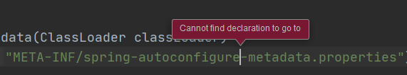
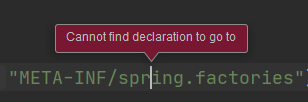
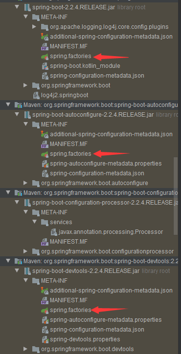
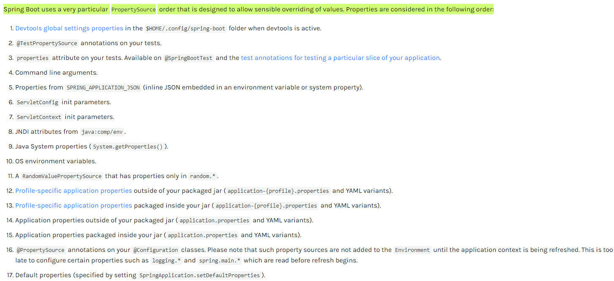

# 2.10  spring boot

1. 自动配置 

   ``` java
   @EnableAutoConfiguration--开启自动配置，
   @AutoConfigurationPackage--扫描包路径下的所有组件，就是我们自己写的组件
       
   利用AutoConfigurationImportSelector导入一些spring boot必须要的组件。
       
   通过debug发现程序运行过程中会调用AutoConfigurationImportSelector中的 selectImport(annotationMetadata)方法，这个方法有如下代码：
       
   AutoConfigurationImportSelector.AutoConfigurationEntry autoConfigurationEntry = this.getAutoConfigurationEntry(autoConfigurationMetadata, annotationMetadata);
   
   AutoConfigurationMetadata autoConfigurationMetadata = AutoConfigurationMetadataLoader.loadMetadata(this.beanClassLoader);
   
   第一句代码 是用于读取 /META-INF/spring-autoconfigure-metadata.properties的相关配置的
   第二句代码 是用于读取 /META-INF/spring.factories的相关配置的
   ```

   

   

   使用idea的自动追踪功能都不能找到相对应的文件，那么这些配置文件究竟是在什么地方呢？

   

   tada~就在引入的spring boot中。

2.  自定义配置

   好奇的我点进去几个spring.factories文件看了一下，

   ``` properties
   # Initializers
   org.springframework.context.ApplicationContextInitializer=\
   org.springframework.boot.autoconfigure.SharedMetadataReaderFactoryContextInitializer,\
   org.springframework.boot.autoconfigure.logging.ConditionEvaluationReportLoggingListener
   
   # Application Listeners
   org.springframework.context.ApplicationListener=\
   org.springframework.boot.autoconfigure.BackgroundPreinitializer
   ......
   ```

   有一大堆的配置。

   spring boot本质上也就是spring框架，但是spring boot把许多组件封装好放入了ioc容器中了，通过简化配置

   来进一步简化了Spring应用的整个搭建和开发过程。而我们虽然可以自己手动写一些配置的文件更改默认的配置。在spring boot官方文档中列举了以下的添加外部配置的方法：

   

   

   在网络上一直看到跟spring boot相关的一句话就是“约定优于配置”，经过一段时间对spring的研究之后深深感觉到有时候自己配置的东西越多，出错的机率就越大。就比方说以前我曾经写过一个小小的登录、注册的web demo，需要自己配置tomcat、配置mybatis等工具和框架，一不留神有一个小细节配置错了导致整个demo运行不起来，折腾了很长时间才搞成功，简直身心俱疲。[这是当时记录的博客](https://blog.csdn.net/weixin_41006725/article/details/103429182)，还想着一直写下去，但是后面真的被那些配置弄得太烦了，所以把比较基础的东西看完理解透了，尝试写了一个ssm demo（就实现了比较简单的登录注册和包括用户的crud功能，现在不知道丢哪了）。本来我也十分顽固，心想着把那个demo弄得好一点，真的被配置弄烦了，再加上我觉得应该学习应该学最前沿的技术，所以现在就开始折腾spring boot了。

hhh给自己加油吧。

