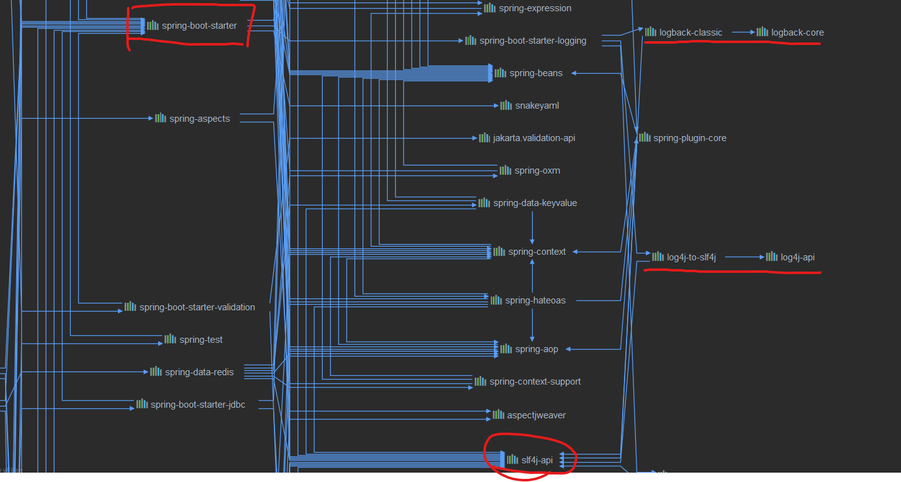
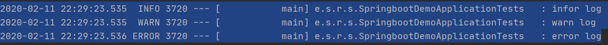

# 2.11 spring boot

**日志 **

spring boot底层统一demo使用slf4j+logback进行日志输出，在写spring boot应用的时候不需要自己再手动引入slf4j+logback的依赖，可以看到spring boot封装了日志等功能。



因此为了spring boot能自动适配所有日志，使用slf4j+logback，引入新的框架时把框架依赖的日志框架排除掉，即是：

```xml
		<dependency>
            <groupId>新框架</groupId>
            <artifactId>xxx</artifactId>
            <exclusions>
            	<exclusion>
                    <groupId>日志框架</groupId>
                    <artifactId>xxx</artifactId>
                </exclusion>
            </exclusions>
            <version>xxx</version>
        </dependency>
```

尝试输出了几个小小的日志。




# 2.12 spring boot

**另一个简单的demo **

```java
添加个人所需的webmvc功能
同时不影响spring boot自动配置
添加configuration，同时实现WebMvcConfigure
如果想自己掌控springMvc的配置，那么就加上EnableWebMvc注解，spring boot对mvc内容的自动配置会失效,因为WebMvcAutoConfiguration中 ConditionalOnMissingBean({WebMvcConfigurationSupport.class})，
就是说在缺少WebMvcConfigurationSupport类型的Bean的时候才会生效。
而EnableWebMvc@Import({DelegatingWebMvcConfiguration.class})DelegatingWebMvcConfiguration继承了WebMvcConfigurationSupport，所以说使用EnableWebMvc注解后需要自己编写所有的Mvc配置。
```

**一组经常记混的注解：RequestParam 和 PathVariable**

网上找到的部分解释：[我基本的理解跟这个差不多](https://blog.csdn.net/exodus3/article/details/92762215)

**demo主体 :** spring boot+jpa+thymeleaf模板的一个简单的注册/登录系统

demo结构：

> main
>
> > java
> >
> > >包名
> > >
> > >> component			——自己希望用到的组件，用于弥补自动装配没有我们需要的东西
> > >>
> > >> config					  ——添加个人所需的webmvc功能，同时不影响spring boot自动配置
> > >>
> > >> controller			    ——各个controller所在的包
> > >>
> > >> dao						   ——连接数据库，这个demo比较简单，于是乎就使用jpa来完成crud
> > >>
> > >> entity						——存放各种表的实体
> > >>
> > >> utils						   ——应用程序所需要的工具
> > >>
> > >> SpringbootDemoApplication.java		——你懂的
> >
> > resources						   ——各种资源和配置

本次demo的流程图：

​	

流程图一画，整个过程就清晰明了~ 接下来就是编码的过程了。

这一个demo还是走着mvc的那一套，mvc模式虽然简单但是还是存在非常多不足的，在百度百科上找到如下mvc模式有以下缺点：

> **没有明确的定义**
>
> 完全理解MVC并不是很容易。使用MVC需要精心的计划，由于它的内部原理比较复杂，所以需要花费一些时间去思考。同时由于模型和视图要严格的分离，这样也给调试应用程序带来了一定的困难。每个构件在使用之前都需要经过彻底的测试。
>
> **不适合小型，中等规模的应用程序**
>
> 花费大量时间将MVC应用到规模并不是很大的应用程序通常会得不偿失。
>
> **增加系统结构和实现的复杂性**
>
> 对于简单的界面，严格遵循MVC，使模型、视图与控制器分离，会增加结构的复杂性，并可能产生过多的更新操作，降低运行效率。
>
> **视图与控制器间的过于紧密的连接**
>
> 视图与控制器是相互分离，但却是联系紧密的部件，视图没有控制器的存在，其应用是很有限的，反之亦然，这样就妨碍了他们的独立重用。
>
> **视图对模型数据的低效率访问**
>
> 依据模型操作接口的不同，视图可能需要多次调用才能获得足够的显示数据。对未变化数据的不必要的频繁访问，也将损害操作性能。
>
> **一般高级的界面工具或构造器不支持模式**
>
> 改造这些工具以适应MVC需要和建立分离的部件的代价是很高的，会造成MVC使用的困难。

而mvc模式的改进，就是经常说的前后端分离。其中采用restful风格就是前后端分离的一种方式。