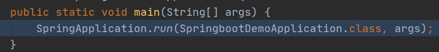
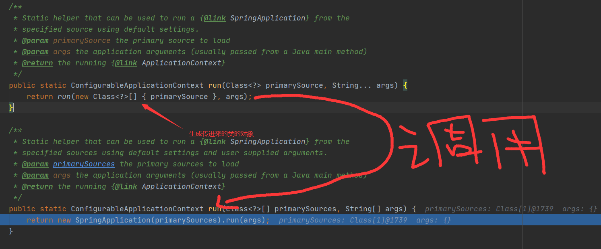
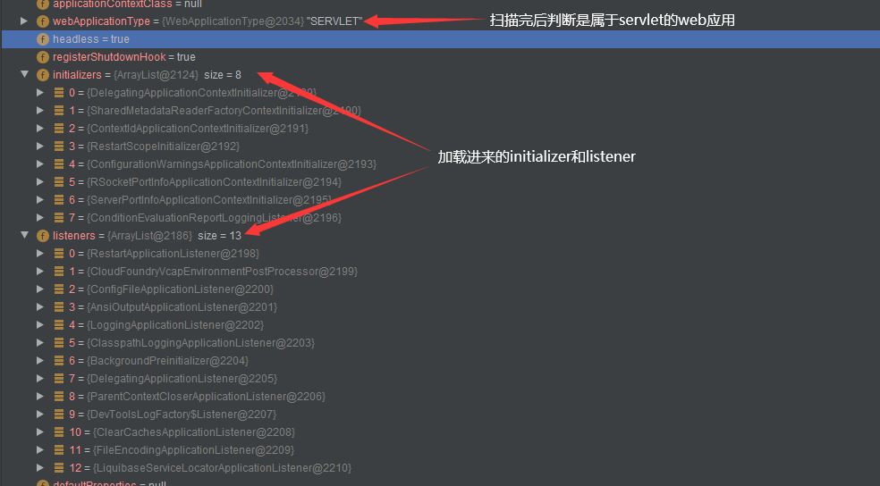
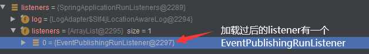
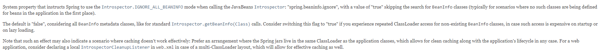
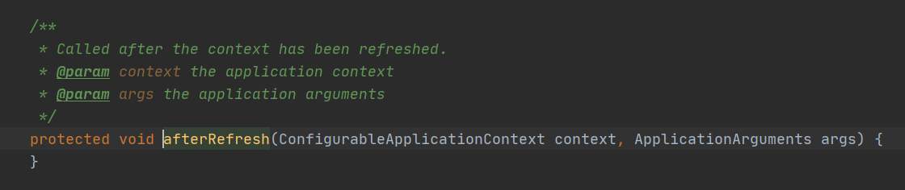
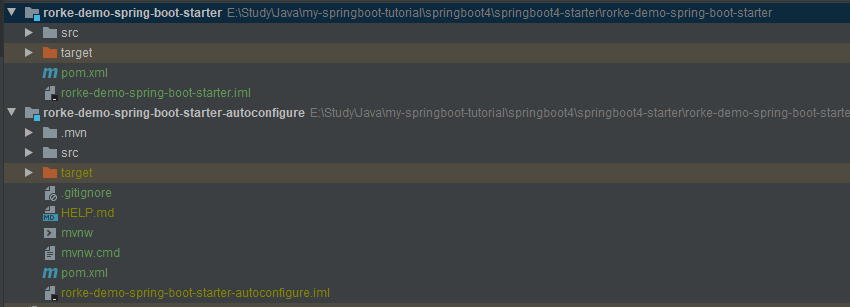
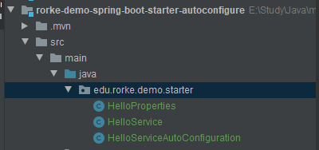
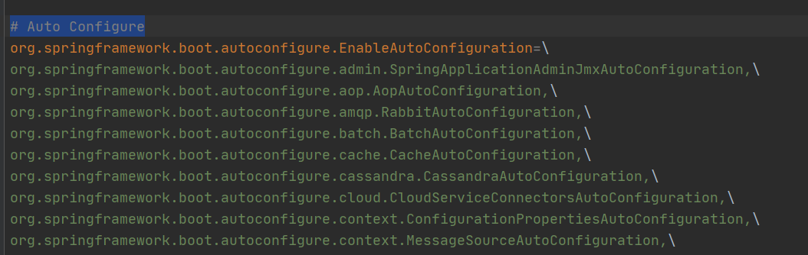

# 2.15 spring boot

### 启动流程

#### 1.创建SpringApplication对象  

main方法中调用SpringApplication中的静态run方法。

把~~-----main方法所在的类------~~**primarySources（有可能传入不只是一个类）**传进去。



肉眼可见，两个静态run方法除了参数列表之外，其他部分都是一样的。简单起见，用run1run2来表示，SpringbootDemoApplication中的main方法调用run1方法，并且传入SpringbootDemoApplication类和args。run1接受到了SpringbootDemoApplication类并生成了对应的对象，调用run2并将此对象传给run2。然后run2调用有参构造器，创建一个SpringApplication对象并调用run方法。

```java
//在SpringApplcation类中
public SpringApplication(ResourceLoader resourceLoader, Class<?>... primarySources) {
	this.resourceLoader = resourceLoader;
	Assert.notNull(primarySources, "PrimarySources must not be null");
	this.primarySources = new LinkedHashSet<>(Arrays.asList(primarySources));
	this.webApplicationType = WebApplicationType.deduceFromClasspath();
	setInitializers((Collection)
    getSpringFactoriesInstances(ApplicationContextInitializer.class));
	setListeners((Collection) getSpringFactoriesInstances(ApplicationListener.class));
	this.mainApplicationClass = deduceMainApplicationClass();
}
//调用的有参构造器
//设置资源读取器；
//根据类路径判断是否为web应用：deduceFromClasspath方法中判断；

//getSpringFactoriesInstances底层调用了loadSpringFactories，而loadSpringFactories的工作原理则就是加载在META-INF下的spring.factories，所以看到getSpringFactoriesInstances(xx,...)，第一个参数就代表了要获取的springfactory类型。

//设置初期化器:加载在META-INF/spring.factories配置的所有ApllicationInitializer；
//设置监听器:加载在META-INF/spring.factories配置的所有ApplicationListener；
//寻找传进来的primarySources中含有main方法的类并设置为主类
static WebApplicationType deduceFromClasspath() {
	if (ClassUtils.isPresent(WEBFLUX_INDICATOR_CLASS, null) && 				              			!ClassUtils.isPresent(WEBMVC_INDICATOR_CLASS, null)
			&& !ClassUtils.isPresent(JERSEY_INDICATOR_CLASS, null)) {
			return WebApplicationType.REACTIVE;
        //reactive类型的web应用，启动对应的嵌入式服务器(netty)
	}
	for (String className : SERVLET_INDICATOR_CLASSES) {
		if (!ClassUtils.isPresent(className, null)) {
			return WebApplicationType.NONE;
            //不是web应用
		}
	}
	return WebApplicationType.SERVLET;
    //servlet型的web应用，启动对应的嵌入式服务器(jetty,tomcat,undertow)
}
```



#### 2.调用run方法

```java
public ConfigurableApplicationContext run(String... args) {
	//省略摘抄一些代码
	SpringApplicationRunListeners listeners = getRunListeners(args);
//	getRunListeners方法代码如下：
//	private SpringApplicationRunListeners getRunListeners(String[] args) {
//	Class<?>[] types = new Class<?>[] { SpringApplication.class, String[].class };
//	return new SpringApplicationRunListeners(logger,
//	getSpringFactoriesInstances(SpringApplicationRunListener.class, types, this, args));
//	}
//  看到getSpringFactroiesInstaces就知道是怎么加载的了；
	listeners.starting();
//  加载过后调用所有listener的starting方法
```



``` java
//	接上面的代码
try {
  
// 	配置控制台参数
	ApplicationArguments applicationArguments = new DefaultApplicationArguments(args);
    
//	准备环境
    ConfigurableEnvironment environment = prepareEnvironment(listeners, applicationArguments);
//	prepareEnvironment方法中创建并配置软件环境，并且调用各个listener中的environmentPrepared方法，然后根据当前环境是否为CustomEnvironment，如果不是则根据是应用的类型转换当前的环境（servlet的web应用、reactive的web应用还是普通的应用）
    
//	配置beaninfo这个属性，这个我也不太懂，上网搜了一下
	configureIgnoreBeanInfo(environment);
```

spring的文档定义如下：

简单来说就是当这个值为true的时候让容器不扫描某些bean，因为这些bean只是在设计、构想，并没有对应的类来定义这些bean。而默认值就是false，相当于扫描所有bean。

```java
//	接上面的代码
//	打印图标，就是spring boot程序启动时的那个spring图标
	Banner printedBanner = printBanner(environment);

//	终于，在这里看到在spring时候的老朋友——ApplicationContext了，也就是我们的ioc容器。他也会根据当前的应用设置生成不同类型的ioc容器——非web的ioc容器和web的ioc容器，而web的ioc容器也有两种，reactive和servlet。最终，利用反射创建了ioc容器。
	context = createApplicationContext();

//	然后就获取报错reporter，看到getSpringFactoriesInstances就知道是什么回事了~
	exceptionReporters = getSpringFactoriesInstances(SpringBootExceptionReporter.class,
	new Class[] { ConfigurableApplicationContext.class }, context);

//	准备上下文环境，其作用如下：
//	1.将environment保存到ioc容器中；
//	2.将beanNameGenerator、resourceLoader、addConversionService注册到ioc容器中；
//	3.调用所有的initializer的initialize方法，initializer就是一开始创建SpringApplication的时候加载的；
//	4.调用所有的listener的contextPrepared方法；
//	5.开启日志的记录；
//	6.注册命令行参数所对应的对象、banner对象以及其他的boot specific singleton beans；
//	7.加载所有的资源，最后调用所有listener的contextLoaded方法；
	prepareContext(context, environment, listeners, applicationArguments, printedBanner);
	
//	加载所有的bean，调用了AbstractApplicationContext的refresh方法
	refreshContext(context);

//	黑人问号，我也不知道是干嘛的。不过我看网上spring boot2.0之前这个方法好像不是空的
	afterRefresh(context, applicationArguments);
```



```java
//	接上面的代码	
	stopWatch.stop();
	if (this.logStartupInfo) {
		new StartupInfoLogger(this.mainApplicationClass).logStarted(getApplicationLog(), stopWatch);
	}
//	回调所有listener的started方法
		listeners.started(context);

//	对比了一下，spring boot2之前的afterRefresh方法里面的内容放到这里了
		callRunners(context, applicationArguments);
	}
	catch (Throwable ex) {
		handleRunFailure(context, ex, exceptionReporters, listeners);
		throw new IllegalStateException(ex);
	}
	try {
        
//	回调所有listener的running方法
		listeners.running(context);
	}
	catch (Throwable ex) {
		handleRunFailure(context, ex, exceptionReporters, null);
		throw new IllegalStateException(ex);
	}
//	返回ioc容器
	return context;
}
```


# 2.18 spring boot

### 编写自己的starter



这是我编写的starter。最上面starter模块就是整个starter的入口，他是一个使用maven的modules，可以它的pom文件中引入我们想用的依赖，包括自己写的也包括引用现成的来组装起来形成一个maven项目。

而下面autoconfigure模块本质上就是一个spring boot项目。引入了一下依赖：分别是spring-boot-autoconfigure、spring-boot-configuration-processor。

```xml
<dependencies>
        <dependency>
            <groupId>org.springframework.boot</groupId>
            <artifactId>spring-boot-autoconfigure</artifactId>
            <version>2.2.4.RELEASE</version>
        </dependency>
        <dependency>
            <groupId>org.springframework.boot</groupId>
            <artifactId>spring-boot-configuration-processor</artifactId>
            <version>2.2.4.RELEASE</version>
            <optional>true</optional>
        </dependency>
</dependencies>
```

其中 spring-boot-configuration-processor 的作用是编译时生成 spring-configuration-metadata.json ，此文件主要给IDE使用。如当配置此jar相关配置属性在 application.yml ，你可以用ctlr+鼠标左键点击属性名，IDE会跳转到你配置此属性的类中。而spring-boot-autoconfigure，顾名思义则是提供自动配置功能的。

我们日常使用的Spring官方的Starter一般采取spring-boot-starter-{name} 的命名方式，如 spring-boot-starter-web 。而非官方的Starter，官方建议 artifactId命名应遵循{name}-spring-boot-starter 的格式。 例如：rorke-demo-spring-boot-starter。



这个starter写的比较简单，只有三个类，分别是properties、service和auto configuration类。

```java
//HelloProperties类

@Component
@ConfigurationProperties(prefix = "edu.rorke")//设置配置属性的前缀
											  //如下面的配置edu.rorke.userName=xxx
public class HelloProperties {
    private String userName;//配置的属性
    private String welcome;

    public String getUserName() {
        return userName;
    }

    public void setUserName(String userName) {
        this.userName = userName;
    }

    public String getWelcome() {
        return welcome;
    }

    public void setWelcome(String welcome) {
        this.welcome = welcome;
    }
}
```

```java
//HelloServiceAutoConfiguration类

@Configuration
@ConditionalOnWebApplication//在web应用的情况下才启用这个配置
@EnableConfigurationProperties(HelloProperties.class)//开启自动配置功能，指明配置的类
public class HelloServiceAutoConfiguration {
    @Autowired
    @Bean
    public HelloService helloService(HelloProperties helloProperties) {
        HelloService service = new HelloService();
        service.setHelloProperties(helloProperties);
        return service;
    }
}
```

这时候还没完成，还需要在resources目录下创建META-INF文件夹并在它下一级目录创建spring.factories文件，告诉spring boot在你自己启动自动装配功能的时候我们的HelloServiceAutoConfiguration也需要你的自动装配功能。spring boot应用程序的入口都有一个`@SpringBootApplication`注解，其中它里面的自动配置注解包含着`@Import(AutoConfigurationImportSelector.class)`，这个注解就会自动扫描各个jar包的META-INF文件夹中的spring-autoconfigure-metadata.properties和spring.factories文件，而使用自动配置的相关自动配置属性则在spring.factories中。



所以我应该在自己写的auto configure模块的resources文件夹中创建META-INF文件夹并创建spring.factories文件，并在里面写自动配置的属性：

```properties
org.springframework.boot.autoconfigure.EnableAutoConfiguration=\
  edu.rorke.demo.starter.HelloServiceAutoConfiguration
```

这样的话就可以将我们的starter中的自动配置交给spring boot去管理了。

### 测试自己的starter

因为在`HelloServiceAutoConfiguration`中添加了`@ConditionalOnWebApplication`注解，所以我们这个starter只在web应用的时候被加载，因此创建了一个简单的spring boot web application来测试。

```java
@RestController
public class HelloController {
    private HelloService helloService;
    @Autowired
    public HelloController(HelloService helloService) {
        this.helloService = helloService;
    }


    @GetMapping("/hello")
    public String hello(){
        return helloService.hello(new Date());
    }
}
//简单的controller进行测试
```

并在application.properties中配置属性：

```properties
edu.rorke.userName:Rorke
edu.rorke.welcome:hello world
```

测试结果：

